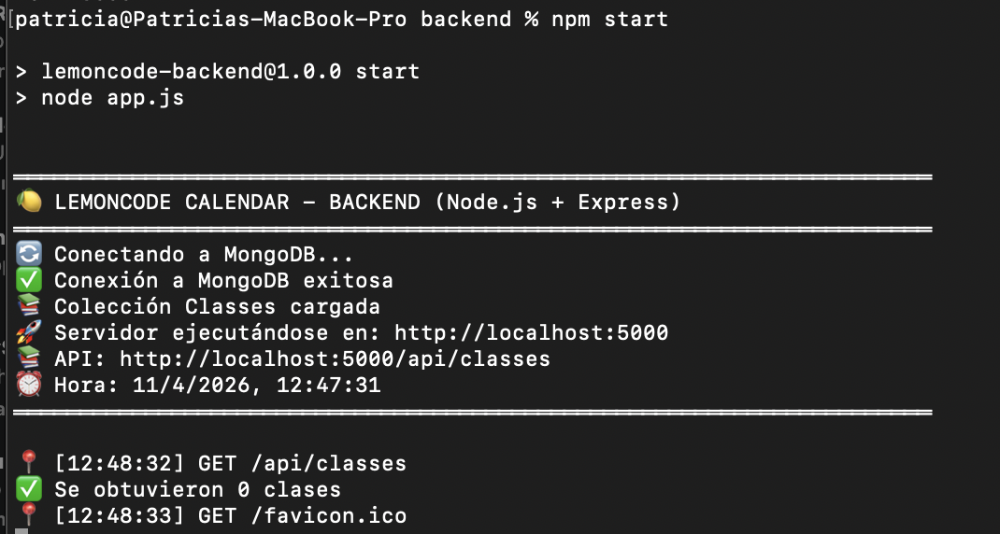
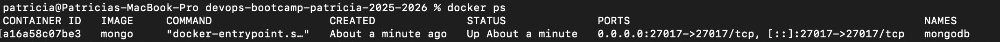
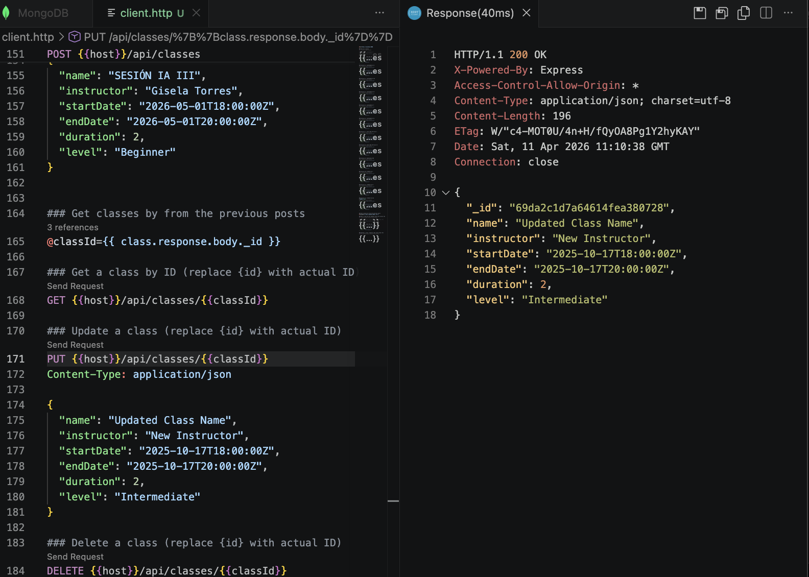
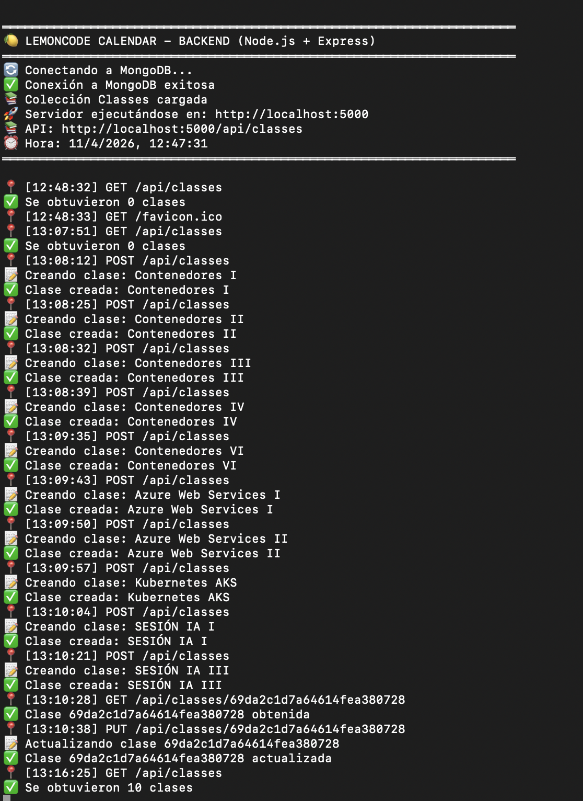
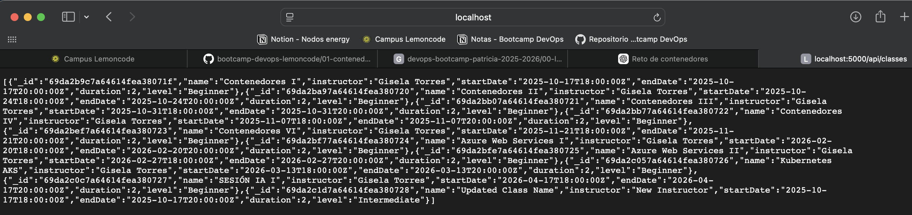

# Reto 1 - MongoDB en contenedor (Lemoncode Calendar)

## Objetivo

En este reto el objetivo era levantar MongoDB dentro de un contenedor Docker y conectar un backend Node.js local para poder realizar operaciones CRUD sobre una base de datos.

---

## Qué se hizo

### 1. Crear una red Docker

Se creó una red para permitir la comunicación entre contenedores (aunque en este reto solo se utilizó MongoDB):

docker network create lemoncode-network

---

### 2. Levantar MongoDB en Docker

Se ejecutó MongoDB en un contenedor con persistencia de datos:

docker run -d \
--name mongodb \
--network lemoncode-network \
-p 27017:27017 \
-v mongodb-data:/data/db \
mongo

Esto permitió tener MongoDB funcionando en local dentro de Docker.

---

### 3. Configuración del backend

Se configuró el archivo .env del backend Node.js para conectarse a MongoDB:

DATABASE_URL=mongodb://localhost:27017  
DATABASE_NAME=LemoncodeCourseDb  
HOST=localhost  
PORT=5000  

---

### 4. Instalación y ejecución del backend

Dentro de la carpeta del backend se instalaron dependencias y se levantó el servidor:

npm install  
npm start  

---

## Comprobaciones realizadas

### 1. Verificación del contenedor MongoDB

Se comprobó que MongoDB estaba corriendo correctamente:

docker ps  

---

### 2. Ejecución de peticiones desde VS Code

Se utilizó la extensión REST Client en VS Code para ejecutar todas las peticiones del archivo:

node-stack/backend/client.http  

Se realizaron:
- GET para obtener clases
- POST para crear clases
- PUT para actualizar clases
- DELETE para eliminar clases

Todas las peticiones se ejecutaron correctamente.

Las respuestas se validaron tanto en la terminal del backend como en la ejecución de las requests en VS Code.

---

### 3. Verificación en backend

Se comprobó en la terminal del backend que las peticiones se procesaban correctamente y que la conexión con MongoDB era exitosa.

Se obtuvo el mensaje de:
- Conexión a MongoDB exitosa  
- API ejecutándose en http://localhost:5000  
- Endpoint disponible en /api/classes  

---

### 4. Verificación en navegador

Se comprobó el estado de la API accediendo a:

http://localhost:5000/api/classes

Ahí se pudo ver el JSON con los datos almacenados en MongoDB.

---

## Resultado final

Al finalizar el reto:

- MongoDB estaba funcionando dentro de Docker  
- El backend Node.js estaba conectado correctamente a MongoDB  
- Se podían realizar operaciones CRUD correctamente  
- Los datos se almacenaban y se podían visualizar en formato JSON  

---

## Conclusión

Este reto permitió levantar un entorno completo de backend + base de datos usando Docker para MongoDB, validando la comunicación entre servicios y el correcto funcionamiento del CRUD desde el backend.