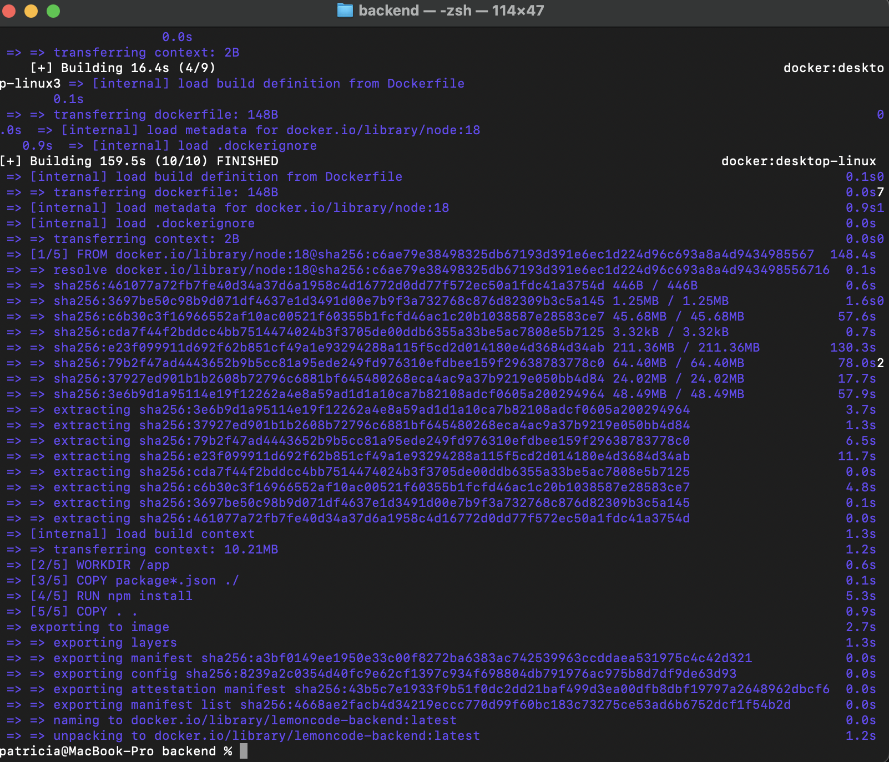
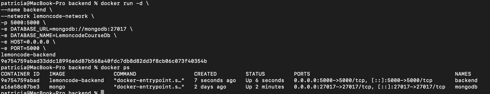
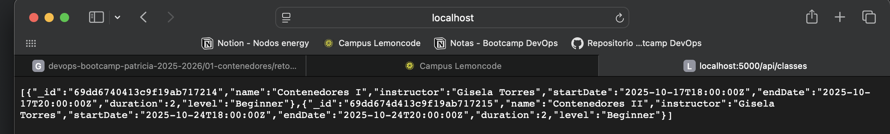
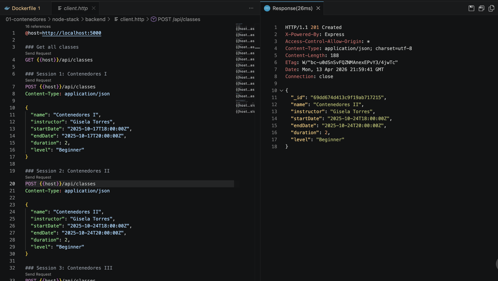

# Reto 2 - Dockerizar el Backend (Lemoncode Calendar)

## Objetivo

En este reto el objetivo fue contenerizar el backend Node.js, ejecutarlo dentro de Docker y conectarlo con MongoDB usando la red creada en el Reto 1.

---

## Qué se hizo

### 1. Creación del Dockerfile

Se creó un archivo llamado Dockerfile dentro de la carpeta backend con la configuración necesaria para construir la imagen del backend Node.js.

Este Dockerfile permite:
- Usar una imagen base de Node.js
- Instalar dependencias del proyecto
- Copiar el código fuente
- Exponer el puerto 5000
- Ejecutar la aplicación

[Click aquí para ver Dockerfile](Dockerfile)

---

### 2. Construcción de la imagen

Se construyó la imagen del backend ejecutando el siguiente comando dentro de la carpeta backend:

docker build -t lemoncode-backend .

---

### 3. Ejecución del contenedor backend

Se ejecutó el backend en un contenedor Docker conectado a la red creada en el Reto 1:

docker run -d \
--name backend \
--network lemoncode-network \
-p 5000:5000 \
-e DATABASE_URL=mongodb://mongodb:27017 \
-e DATABASE_NAME=LemoncodeCourseDb \
-e HOST=0.0.0.0 \
-e PORT=5000 \
lemoncode-backend

---

## Configuración importante

Para la conexión a MongoDB se utilizó:

DATABASE_URL=mongodb://mongodb:27017

Esto es importante porque dentro de Docker no se usa localhost, sino el nombre del contenedor (mongodb) como hostname.

---

## Comprobaciones realizadas

### 1. Verificación de contenedores

Se comprobó que ambos contenedores estaban en ejecución:

docker ps

Se verificó que:
- mongodb estaba en estado Up
- backend estaba en estado Up

---

### 2. Verificación de logs del backend

Se revisaron los logs del contenedor backend:

docker logs backend

Se comprobó que aparecía el mensaje de conexión exitosa a MongoDB.

---

### 3. Verificación de la API

Se accedió desde el navegador a:

http://localhost:5000/api/classes

Se comprobó que la API respondía correctamente mostrando los datos en formato JSON.

---

### 4. Prueba con REST Client

Se utilizó el archivo client.http para ejecutar peticiones:

node-stack/backend/client.http

Se realizaron peticiones GET y POST comprobando que:
- La API respondía correctamente
- Los datos se almacenaban en MongoDB

---

## Resultado final

Al finalizar el reto:

- El backend Node.js se ejecuta dentro de un contenedor Docker
- Se conecta correctamente a MongoDB usando la red Docker
- La API responde correctamente en el puerto 5000
- Se pueden realizar operaciones CRUD sin problemas

---

## Conclusión

Este reto permitió contenerizar el backend y entender la comunicación entre contenedores dentro de una red Docker, utilizando nombres de servicio en lugar de localhost y resolviendo problemas comunes de conectividad.