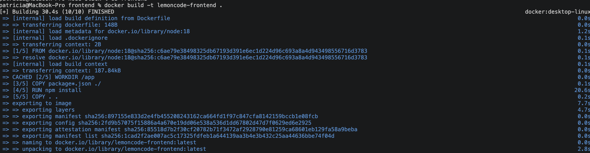
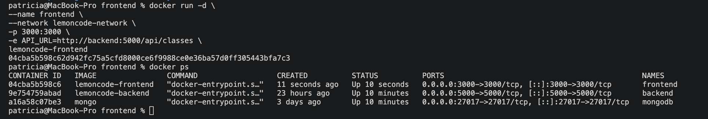
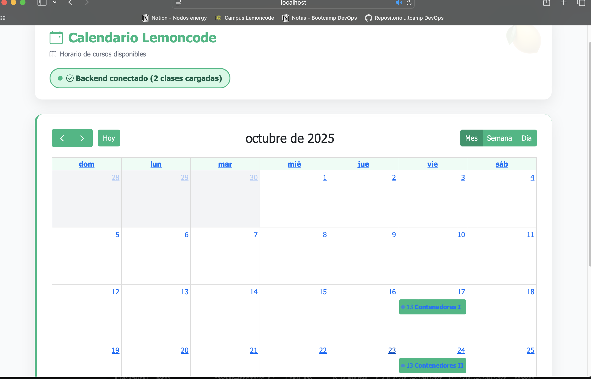

# Reto 3 - Dockerizar el Frontend (Lemoncode Calendar)

## Objetivo

En este reto el objetivo fue contenerizar el frontend de la aplicación, ejecutarlo dentro de Docker y conectarlo con el backend a través de la red Docker creada previamente.

---

## Qué se hizo

### 1. Creación del Dockerfile

Se creó un archivo Dockerfile dentro de la carpeta node-stack/frontend.

Este archivo permite:
- Usar una imagen base de Node.js
- Instalar las dependencias del proyecto
- Copiar el código fuente
- Exponer el puerto 3000
- Ejecutar la aplicación frontend

[Click aquí para ver Dockerfile](Dockerfile)

---

### 2. Construcción de la imagen

Se construyó la imagen del frontend ejecutando el siguiente comando dentro de la carpeta frontend:

docker build -t lemoncode-frontend .

---

### 3. Configuración de variables de entorno

Se configuró la variable de entorno necesaria para que el frontend pudiera comunicarse con el backend.

Se utilizó:

API_URL=http://backend:5000/api/classes

Esto es importante porque dentro de Docker no se usa localhost, sino el nombre del contenedor (backend) para la comunicación entre servicios.

---

### 4. Ejecución del contenedor frontend

Se ejecutó el frontend en un contenedor Docker conectado a la red lemoncode-network:

docker run -d \
--name frontend \
--network lemoncode-network \
-p 3000:3000 \
-e API_URL=http://backend:5000/api/classes \
lemoncode-frontend

---

## Comprobaciones realizadas

### 1. Verificación de contenedores

Se comprobó que los tres contenedores estaban en ejecución:

docker ps

Se verificó que:
- mongodb estaba en estado Up
- backend estaba en estado Up
- frontend estaba en estado Up

---

### 2. Verificación en navegador

Se accedió desde el navegador a:

http://localhost:3000

Se comprobó que:
- La interfaz web cargaba correctamente
- Se mostraban las clases previamente creadas
- El frontend se comunicaba correctamente con el backend

---

### 3. Verificación funcional

Desde la interfaz web se pudo validar que:
- Los datos provenían de MongoDB
- El flujo completo frontend → backend → base de datos funcionaba correctamente

---
## Resultado final

Al finalizar el reto:

- El frontend se ejecuta dentro de un contenedor Docker
- Se conecta correctamente al backend mediante la red Docker
- El backend sigue conectado a MongoDB
- La aplicación completa es accesible desde http://localhost:3000
- Se visualizan correctamente los datos en la interfaz web

---

## Conclusión

Este reto permitió completar la arquitectura de la aplicación, integrando el frontend dentro de Docker y validando la comunicación entre todos los servicios mediante una red compartida, utilizando nombres de contenedor en lugar de localhost.