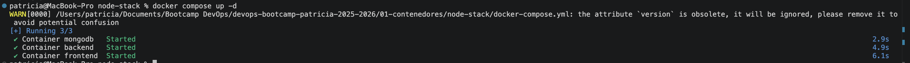
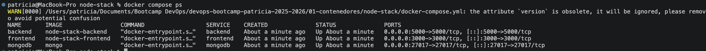
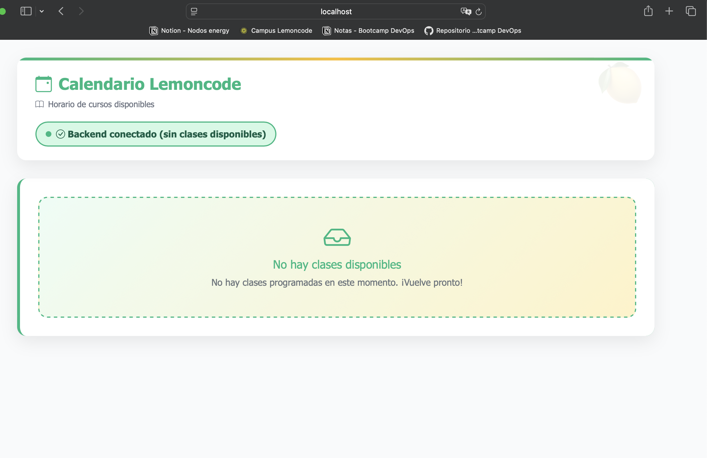

# Reto 4 - Docker Compose (Lemoncode Calendar)

## Objetivo

En este reto el objetivo fue orquestar todos los servicios de la aplicación (MongoDB, Backend y Frontend) utilizando Docker Compose, permitiendo levantar toda la arquitectura con un único comando.

---

## Qué se hizo

### 1. Creación del archivo compose.yml

Se creó un archivo llamado compose.yml en la carpeta node-stack.

Este archivo define los tres servicios de la aplicación:
- MongoDB como base de datos
- Backend Node.js como API
- Frontend como interfaz de usuario

[Click aquí para ver Docker Compose](docker-compose.yml)

---

### 2. Configuración de servicios

Se configuraron los siguientes servicios dentro del compose:

#### MongoDB
- Uso de la imagen oficial de Mongo
- Exposición del puerto 27017
- Configuración de volumen para persistencia de datos

#### Backend
- Construcción de la imagen desde la carpeta backend
- Exposición del puerto 5000
- Configuración de variables de entorno para conexión a MongoDB
- Dependencia del servicio MongoDB

#### Frontend
- Construcción de la imagen desde la carpeta frontend
- Exposición del puerto 3000
- Configuración de variable de entorno para conexión con el backend
- Dependencia del servicio backend

---

### 3. Configuración de red

Se definió una red compartida llamada lemoncode-network para permitir la comunicación entre los servicios utilizando los nombres de contenedor:

- mongodb
- backend
- frontend

---

### 4. Configuración de volumen

Se definió un volumen llamado mongodb-data para garantizar la persistencia de los datos de MongoDB.

---

### 5. Ejecución de la aplicación

Se levantaron todos los servicios con un único comando:

docker compose up -d

---

## Comprobaciones realizadas

### 1. Verificación de servicios

Se verificó que todos los servicios estaban en ejecución:

docker compose ps

Se comprobó que:
- mongodb estaba en estado Up
- backend estaba en estado Up
- frontend estaba en estado Up

---

### 2. Verificación en navegador

Se accedió a la aplicación desde:

http://localhost:3000

Se comprobó que:
- La interfaz cargaba correctamente
- Se mostraban las clases previamente creadas
- El flujo completo funcionaba correctamente

---

## Resultado final

Al finalizar el reto:

- Toda la aplicación se ejecuta con un único comando
- Los servicios están correctamente orquestados
- Existe persistencia de datos en MongoDB
- La aplicación es accesible desde http://localhost:3000
- El flujo completo frontend → backend → base de datos funciona correctamente

---

## Conclusión

Este reto permitió aprender a orquestar múltiples servicios utilizando Docker Compose, simplificando la gestión de contenedores y permitiendo levantar una arquitectura completa de manera sencilla y reproducible.