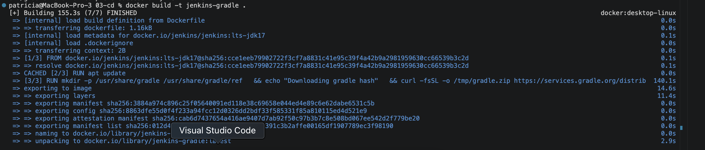
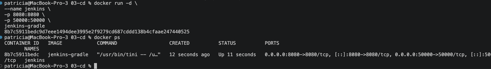
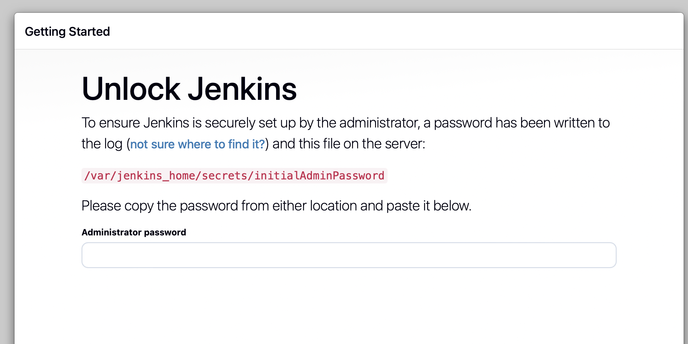
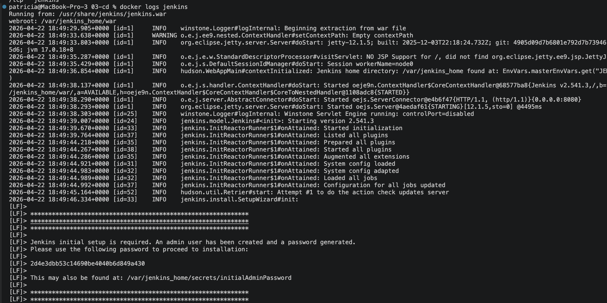
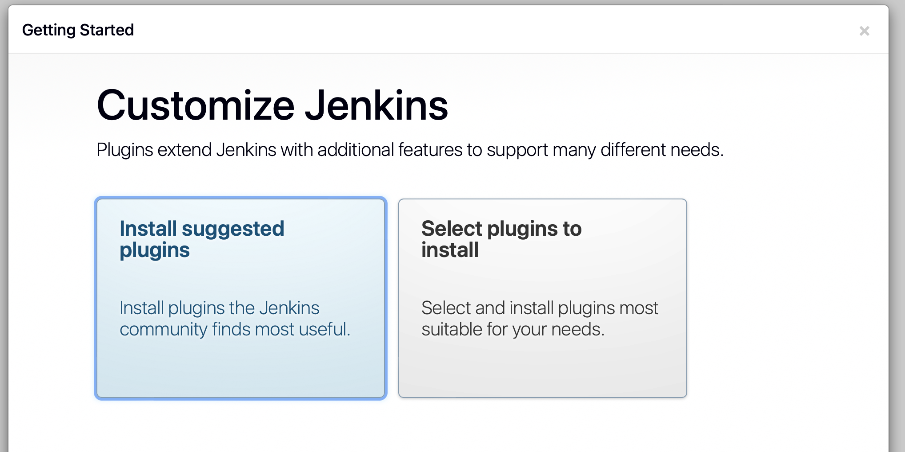
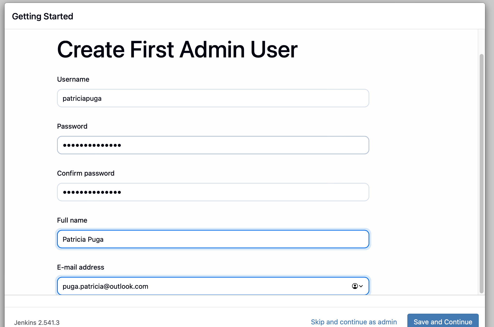
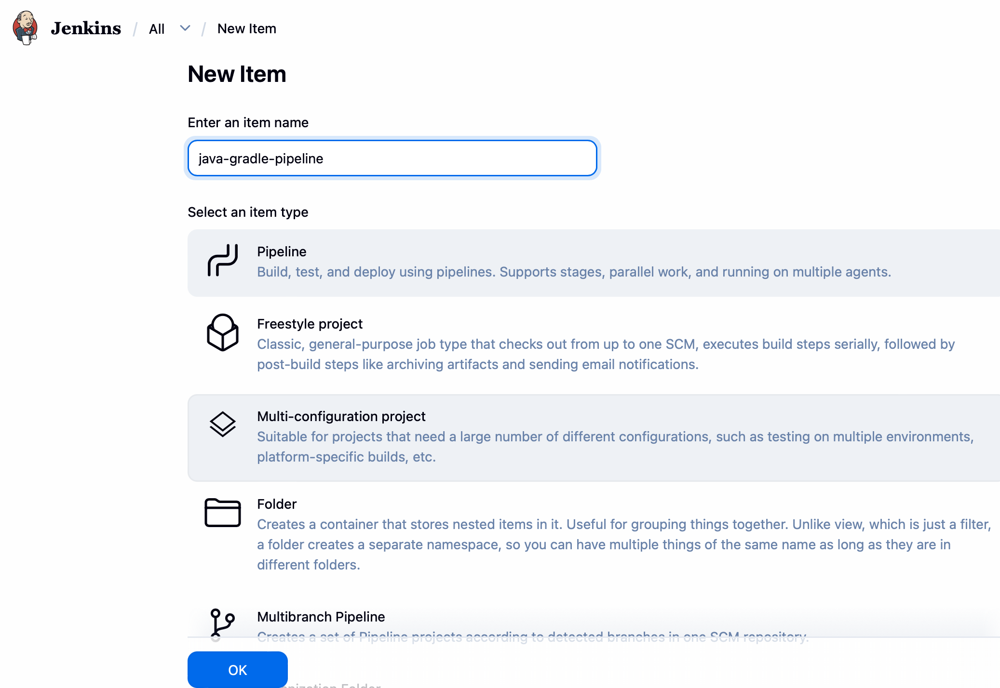
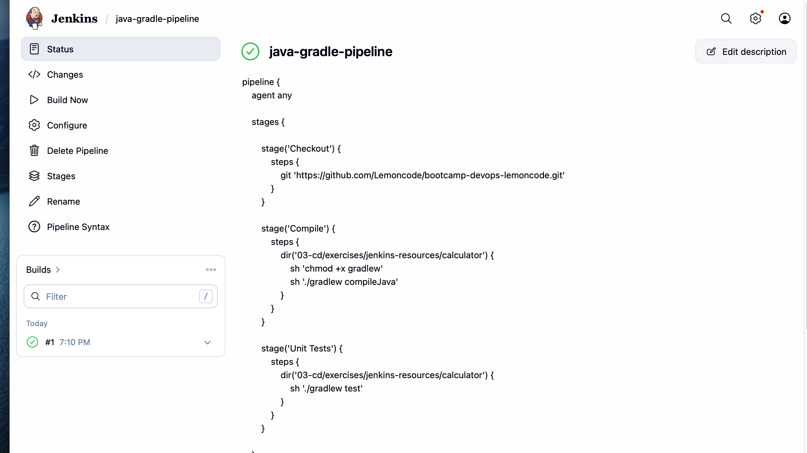
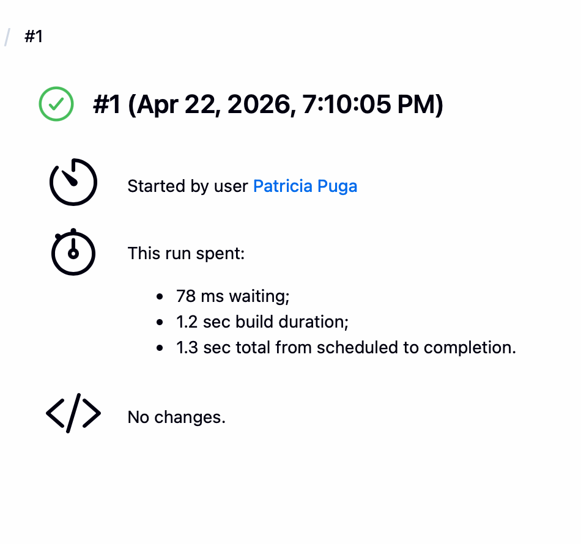

# Ejercicios Jenkins 1

## CI/CD de una Java + Gradle

## Objetivo

El objetivo de este ejercicio fue crear una pipeline de integración continua utilizando Jenkins para un proyecto Java gestionado con Gradle.

La pipeline debía ser capaz de descargar el código fuente, compilarlo y ejecutar los tests automáticamente.

---

## Qué se hizo

### 1. Creación de una imagen personalizada de Jenkins

Se utilizó un Dockerfile para crear una imagen de Jenkins que incluye:

- Java 17
- Gradle instalado

Esto permite ejecutar proyectos Java con Gradle dentro del entorno de Jenkins.

---

### 2. Construcción de la imagen

Se construyó la imagen personalizada de Jenkins con el siguiente comando:

docker build -t jenkins-gradle .

---

### 3. Ejecución de Jenkins en contenedor

Se levantó Jenkins en un contenedor Docker exponiendo los puertos necesarios:

docker run -d \
--name jenkins \
-p 8080:8080 \
-p 50000:50000 \
jenkins-gradle

---

### 4. Acceso a Jenkins

Se accedió a la interfaz web desde:

http://localhost:8080

Se completó la configuración inicial instalando los plugins sugeridos y creando un usuario.

---

### 5. Creación de la pipeline

Se creó un nuevo job de tipo Pipeline en Jenkins.

---

### 6. Creación del Jenkinsfile

Se definió una pipeline declarativa con los siguientes stages:

- Checkout: descarga del código desde GitHub
- Compile: compilación del proyecto con Gradle
- Unit Tests: ejecución de tests unitarios

El repositorio utilizado fue:

https://github.com/Lemoncode/bootcamp-devops-lemoncode.git

Dado que el proyecto se encuentra dentro de una subcarpeta, se utilizó dir() para acceder a la ruta correcta antes de ejecutar los comandos de Gradle.

---

## Comprobaciones realizadas

### 1. Ejecución de la pipeline

Se ejecutó la pipeline desde Jenkins utilizando la opción "Build Now".

---

### 2. Verificación de stages

Se comprobó que todos los stages se ejecutaban correctamente:

- Checkout completado
- Compilación exitosa
- Tests ejecutados correctamente

---

### 3. Resultado final

La ejecución finalizó con estado SUCCESS, indicando que la pipeline funciona correctamente.

---

## Conclusión

Este ejercicio permitió implementar un flujo básico de integración continua utilizando Jenkins, automatizando la descarga de código, la compilación y la ejecución de tests en un proyecto Java con Gradle.